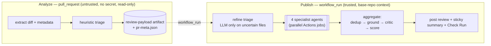

# PR Sentinel

**A multi-agent AI code reviewer that runs entirely inside GitHub Actions — on a free personal GitHub account, with zero write access to your code and a human at every gate.**

When a pull request opens or updates, specialist LLM agents analyse the diff in parallel, cross-check each other, and post one consolidated review: inline comments, a severity-scored summary, and a Check Run. Every finding is grounded in a verbatim quote from the diff, every posted comment explains *fact → impact → recommendation → rule → confidence*, and the bot never pushes code — it proposes GitHub "suggested changes" that a human clicks to apply.

- **No infrastructure.** No external vector DB, no Postgres/Redis, no Docker stack, no self-hosted runner. State lives in run artifacts, `actions/cache` (SQLite), and the PR itself.
- **One secret.** Only `PR_SENTINEL_LLM_API_KEY` (your model key). `GITHUB_TOKEN` is provided by Actions and is used **only** for GitHub REST calls — never as the model key.
- **Fork-safe by construction.** The pipeline is split by *trust*, not just by concern, so untrusted fork PRs get reviewed without ever gaining access to your secret or write scope.
- **Provider-swappable.** `anthropic` (default, `claude-sonnet-5`), `openai`, `azure`, `ollama`, or `replay` — all behind one interface, config-only to switch.

---

## How it works — the split analyse/publish pattern

GitHub withholds repository secrets from fork-triggered `pull_request` runs. PR Sentinel turns that constraint into its security model by splitting the pipeline into two workflows across the trust boundary:



- **Analyze** runs on `pull_request` with `permissions: contents: read`, **no secret**, **no write scope**. It extracts the diff and runs *heuristic* triage only — no model call. Safe even on untrusted fork code.
- **Publish** runs on `workflow_run` in the **base-repo context**, so it has the secret and write scope. **All inference lives here.** It never checks out PR head code; it reads `pr_number`/`head_sha` from the `pr-meta.json` artifact (never trusting a branch name), then posts the review, upserts a sticky summary comment, and completes the Check Run.

This is why an untrusted fork PR can be reviewed while your `PR_SENTINEL_LLM_API_KEY` and write permissions stay out of its reach.

---

## The agents

Collaboration is **artifact-based**, not agent-to-agent chat: each specialist writes a JSON artifact and the aggregator is the only consumer — so every step is inspectable in the Actions UI.

| Agent | Scope | Owns |
|---|---|---|
| **Triage** | changed files + metadata + CI results | per-file language, risk, which agents to run; enforces the call budget |
| **Bug** | high/med-risk hunks | null derefs, off-by-one, resource leaks, mutable defaults, races, inverted logic |
| **Security** | *all* changed hunks (never skipped) | OWASP Top 10 / CWE: injection, deserialization, path traversal, SSRF, hardcoded secrets, weak crypto, authz gaps |
| **Style** | high/med-risk hunks | PEP 8 / Effective Go / Airbnb / Rust guidelines; bare excepts, magic numbers, naming, missing docstrings (defers to your team's conventions) |
| **Improvement** | high-risk hunks | modern idioms, stdlib over hand-rolled, missing tests for new branches |
| **Critic** | merged findings | deletes false positives and ungrounded findings, downgrades over-severe ones, caps nit noise |
| **Fixer** | opt-in, critical/high | minimal patch as a GitHub ` ```suggestion ` block — never auto-applied |

**Grounding** is the core quality mechanism: every finding carries an `evidence_quote` that must be a verbatim substring of the changed hunk, with a line number inside the PR's changed range and a `rule_id` from a known taxonomy (`CWE-…`, `OWASP-A…`, `PEP8-…`, `SENTINEL-…`). Anything that fails is dropped and counted in `grounding_rejects` — never posted.

---

## Quick start — review another repo (no vendoring, no fork)

PR Sentinel can review **any** repo's PRs without that repo installing it. The two templates in [`templates/consumer-workflows/`](templates/consumer-workflows) fetch the tool on demand with `uvx` and drive it over the GitHub REST API.

1. **Copy the two templates** into the consuming repo, keeping the filenames — their `name:` fields must stay `PR Review Analyze` / `PR Review Publish` (the publish workflow triggers on the analyze workflow by name):
   ```
   templates/consumer-workflows/pr-review-analyze.yml → .github/workflows/pr-review-analyze.yml
   templates/consumer-workflows/pr-review-publish.yml → .github/workflows/pr-review-publish.yml
   ```
2. **Add one repo secret** — *Settings → Secrets and variables → Actions → New repository secret*:
   ```
   Name:  PR_SENTINEL_LLM_API_KEY
   Value: <your Anthropic (or OpenAI-compatible) model key>
   ```
3. **Open a PR.** Analyze runs on `pull_request`; Publish runs after it via `workflow_run` and posts the review, sticky summary, and `PR Sentinel` Check Run.

> ⚠️ **Pin before production.** The templates fetch `...pr-sentinel.git@main`. For anything past a demo, pin `@main` to a commit SHA or release tag in every `uvx --from` line so review behaviour can't change under you. See [`docs/CROSS_REPO_USAGE.md`](docs/CROSS_REPO_USAGE.md).

Optional per-repo **variables** (not secrets), all with sane defaults: `PR_SENTINEL_MODEL` (`claude-sonnet-5`), `PR_SENTINEL_LLM_PROVIDER` (`anthropic`), `PR_SENTINEL_TRIAGE_STRATEGY` (`hybrid`).

---

## Slash commands

Comment on a PR (authorised to `OWNER`/`MEMBER`/`COLLABORATOR`, else silently ignored):

- `/sentinel review` · `/sentinel review security` — re-run the review (optionally one agent)
- `/sentinel fix <id>` — open a branch + PR with a suggested patch (into the feature branch; never auto-applied)
- `/sentinel explain <id>` · `/sentinel ignore <id> <reason>`
- `/sentinel deep` — one re-run on a stronger model, hard-capped 1/day

---

## Local development

Requires **Python 3.11+** and [`uv`](https://docs.astral.sh/uv/).

```bash
uv sync                                            # install
uv run ruff check . && uv run ruff format --check . # lint + format
uv run mypy src                                     # strict-clean types
uv run pytest -q                                    # full suite, zero LLM calls (replay provider)
uv run pytest --cov=src/pr_sentinel --cov-report=term-missing
```

Run a review offline against a fixture, or the eval harness against the golden set:

```bash
uv run pr-sentinel local --path fixtures/synthetic_prs/py_sqli/   # single offline case (replay)
uv run pr-sentinel eval --suite golden                            # eval metrics + markdown summary
```

The `pr-sentinel` CLI also exposes the pipeline steps used by the workflows: `extract`, `triage`, `refine`, `agent`, `aggregate`, `check-start`, `publish`, `check-fail`, plus `smoke` and `report`.

---

## Configuration & governance

All config is via `PR_SENTINEL_*` environment variables (see `src/pr_sentinel/settings.py`).

- **Provider (C1).** `PR_SENTINEL_LLM_PROVIDER` selects `anthropic | openai | azure | ollama | replay`. Credential is `PR_SENTINEL_LLM_API_KEY` (+ optional `PR_SENTINEL_LLM_BASE_URL` for OpenAI-compatible / Azure / self-hosted endpoints). No provider name is hardcoded outside `llm/provider.py`.
- **Cost cap (C2).** The hard governor is **dollars**: `PR_SENTINEL_MAX_USD_PER_RUN` (default `$1.00`), computed from a token ledger at standard rates (**claude-sonnet-5: $3.00 in / $15.00 out per 1M**; cache read ≈ 0.1×, write ≈ 1.25×). `MAX_LLM_CALLS_PER_RUN` (target ≤ 12/PR) is a secondary cap. Content-hash caching, diff-only analysis, and hunk batching keep runs cheap.
- **Token ceilings (C3).** `MAX_INPUT_TOKENS` (default 8 000) / `MAX_OUTPUT_TOKENS` (default 4 000). Whole files are never sent — diff hunks plus a small context window, token-counted before every call.

Each run reports tokens, a notional USD figure at standard rates, cache hit/write counts, and per-agent errors in the `$GITHUB_STEP_SUMMARY`.

---

## Responsible AI & guardrails

- **Secret redaction** runs before any payload leaves the process (AWS keys, GitHub PATs, PEM blocks, JWTs, connection strings…). A redaction hit is itself emitted as a critical `CWE-798` finding.
- **Prompt-injection defence.** Diff content is wrapped as untrusted data; injection patterns are reported as `SENTINEL-SEC-001`, never obeyed. Output is post-validated (schema-valid JSON, file paths ⊆ input paths).
- **Never a false pass.** If every agent errors, the score is `0` with a failure banner — never a silent `100/100`. `agent_errors` is a first-class field and bare excepts are banned (`E722` enforced).
- **Tone & fairness.** Critique the code, never the author; cite a named rule; cap nit noise. Any finding touching auth, crypto, or payments is auto-tagged *requires-human-review*.
- **Autonomy boundary** (enforced in `guardrails/policy.py`): the bot may read the PR, call the model, and post advisory comments/Check Runs — it may **never** push to a branch, force-push, modify workflows, merge, or submit an `APPROVE` review.

Every privileged action is written to an append-only `audit.jsonl` artifact.

---

## Repository layout

```
src/pr_sentinel/
  cli.py            # typer CLI: analyze | agent | aggregate | publish | eval | local | ...
  settings.py       # pydantic-settings; all config via PR_SENTINEL_* env vars
  models.py         # Finding, Hunk, TriagePlan, AgentResult, ReviewReport
  llm/              # provider registry, budget governor, cache, JSON-mode repair
  gh/               # REST client, diff parser, PR context, publish (Reviews/Checks API)
  agents/           # triage, bug, security, style, improvement, critic, fixer
  graph/            # LangGraph state + build (micro-orchestration inside each job)
  core/             # language detection, chunking, grounding, dedup, scoring
  guardrails/       # redaction, injection, policy allowlist
  evals/            # harness, metrics, report
  prompts/          # externalised, versioned prompts (version feeds the cache key)
.github/workflows/  # ci-validation, security-validate, pr-review-analyze/publish,
                    # agent-command, nightly-repo-report
templates/consumer-workflows/  # drop-in workflows for reviewing other repos via uvx
fixtures/           # synthetic PRs (golden set) + recorded replay responses
docs/               # CROSS_REPO_USAGE, RUNBOOK, verification, demo guide
```

---

## Testing & evaluation

Unit tests are deterministic and cost **zero LLM calls** (`PR_SENTINEL_LLM_PROVIDER=replay`). High-value coverage includes diff-parser line-number fidelity, language detection, budget-aware chunking, dedup, scoring (incl. the all-agents-failed → 0 case), the grounding filter, redaction, injection detection, and the budget governor.

`pr-sentinel eval --suite golden` replays `fixtures/synthetic_prs/` against these target thresholds:

| Metric | Target |
|---|---|
| Recall on planted critical+high defects | ≥ 0.90 |
| Precision | ≥ 0.70 |
| Groundedness (findings surviving the evidence filter) | ≥ 0.95 |
| Duplicate rate after dedup | ≤ 0.05 |
| LLM calls per PR | ≤ 12 |
| p95 wall-clock per PR | ≤ 180 s |

---

## Status

Early-stage (`0.1.0`). The analyze → publish pipeline, the four specialists + critic, grounding, cost governance, and the cross-repo `uvx` templates are implemented and have been exercised end to end on live PRs. See [`docs/`](docs) for the build plan, runbooks, and verification records.
